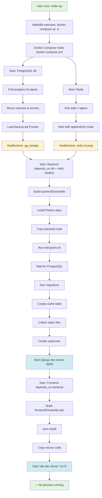

Mermaid Flow Diagram

```mermaid

graph TD
    A[User runs: make up] --> B[Makefile executes: docker-compose up -d]
    B --> C[Docker Compose reads docker-compose.yml]

    C --> D1[Start: PostgreSQL db]
    C --> D2[Start: Redis]

    D1 --> E1[Pull postgres:15-alpine]
    E1 --> E2[Mount volumes & secrets]
    E2 --> E3[Load backup.sql if exists]
    E3 --> E4[Healthcheck: pg_isready]

    D2 --> F1[Pull redis:7-alpine]
    F1 --> F2[Start with appendonly mode]
    F2 --> F3[Healthcheck: redis-cli ping]

    E4 --> G[Start: Backend depends_on db + redis healthy]
    F3 --> G

    G --> H1[Build backend/Dockerfile]
    H1 --> H2[Install Python deps]
    H2 --> H3[Copy backend code]
    H3 --> H4[Run entrypoint.sh]

    H4 --> I1[Wait for PostgreSQL]
    I1 --> I2[Run migrations]
    I2 --> I3[Create cache table]
    I3 --> I4[Collect static files]
    I4 --> I5[Create superuser]
    I5 --> I6[Start Django dev server :8000]

    I6 --> J[Start: Frontend depends_on backend]

    J --> K1[Build frontend/Dockerfile.dev]
    K1 --> K2[npm install]
    K2 --> K3[Copy source code]
    K3 --> K4[Start Vite dev server :5173]

    K4 --> L[✅ All services running]

    style A fill:#e1f5e1
    style L fill:#e1f5e1
    style E4 fill:#fff3cd
    style F3 fill:#fff3cd
    style I6 fill:#d1ecf1
    style K4 fill:#d1ecf1
```